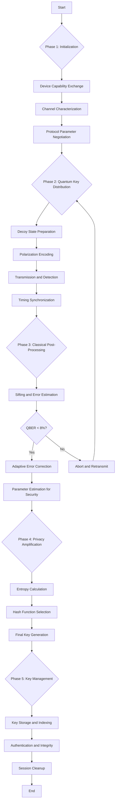

```mermaid
graph TD
    A[Start] --> B{Phase 1: Initialization};
    B --> C[Device Capability Exchange];
    C --> D[Channel Characterization];
    D --> E[Protocol Parameter Negotiation];
    E --> F{Phase 2: Quantum Key Distribution};
    F --> G[Decoy State Preparation];
    G --> H[Polarization Encoding];
    H --> I[Transmission and Detection];
    I --> J[Timing Synchronization];
    J --> K{Phase 3: Classical Post-Processing};
    K --> L[Sifting and Error Estimation];
    L --> M{QBER < 8%?};
    M -- Yes --> N[Adaptive Error Correction];
    M -- No --> O[Abort and Retransmit];
    O --> F;
    N --> P[Parameter Estimation for Security];
    P --> Q{Phase 4: Privacy Amplification};
    Q --> R[Entropy Calculation];
    R --> S[Hash Function Selection];
    S --> T[Final Key Generation];
    T --> U{Phase 5: Key Management};
    U --> V[Key Storage and Indexing];
    V --> W[Authentication and Integrity];
    W --> X[Session Cleanup];
    X --> Y[End];
```
