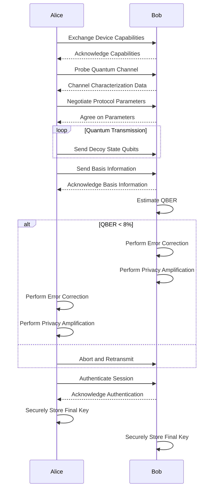

```mermaid
sequenceDiagram
    participant Alice
    participant Bob

    Alice->>Bob: Exchange Device Capabilities
    Bob-->>Alice: Acknowledge Capabilities

    Alice->>Bob: Probe Quantum Channel
    Bob-->>Alice: Channel Characterization Data

    Alice->>Bob: Negotiate Protocol Parameters
    Bob-->>Alice: Agree on Parameters

    loop Quantum Transmission
        Alice->>Bob: Send Decoy State Qubits
    end

    Alice->>Bob: Send Basis Information
    Bob-->>Alice: Acknowledge Basis Information

    Bob->>Bob: Estimate QBER
    alt QBER < 8%
        Bob->>Bob: Perform Error Correction
        Bob->>Bob: Perform Privacy Amplification
        Alice->>Alice: Perform Error Correction
        Alice->>Alice: Perform Privacy Amplification
    else
        Alice->>Bob: Abort and Retransmit
    end

    Alice->>Bob: Authenticate Session
    Bob-->>Alice: Acknowledge Authentication

    Alice->>Alice: Securely Store Final Key
    Bob->>Bob: Securely Store Final Key
```
